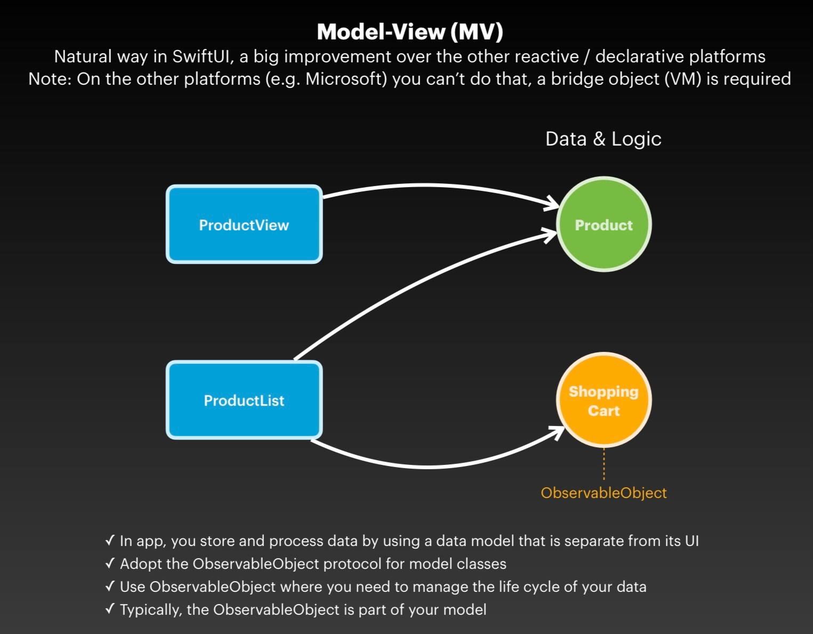

This repository contains a collection of tutorials and notes from Mohammad Azam's course on Udemy that I have learned from and documented.
# List And Navigation
# State And Binding
1. State: The @State property wrapper is used to create a mutable state for a value type. SwiftUI manages the storage of any property you declare as a state. When the state value changes, the view invalidates its appearance and recomputes the body.
```swift
@State private var isToggled = false
```
2. Binding: The @Binding property wrapper is used when you want to create a two-way connection between a variable and a view. When you modify the variable, the view updates, and when you modify the view, the variable updates.
```swift
@Binding var text: String
```
You can create a binding from a state like this:

```swift
Toggle(isOn: $isToggled) {
    Text("Toggle me")
}
```
3. ObservedObject: The @ObservedObject property wrapper is used when you want to create a mutable reference to a reference type that conforms to the ObservableObject protocol. When any of the object's @Published properties change, the view invalidates its appearance and recomputes the body.

```swift
class User: ObservableObject {
    @Published var name: String
}

struct ContentView: View {
    @ObservedObject var user: User
}
```

4. EnvironmentObject: The @EnvironmentObject property wrapper is used when you want to create a mutable reference to a reference type that conforms to the ObservableObject protocol and is provided as an environment value. When any of the object's @Published properties change, the view invalidates its appearance and recomputes the body.

```swift
class User: ObservableObject {
    @Published var name: String
}

struct ContentView: View {
    @EnvironmentObject var user: User
}
```
5. StateObject: The @StateObject property wrapper is used when you want to create a mutable reference to a reference type that conforms to the ObservableObject protocol and you want SwiftUI to manage the lifecycle of the object.

```swift
class User: ObservableObject {
    @Published var name: String
}

struct ContentView: View {
    @StateObject var user = User()
}
```

| Property Wrapper | Use Case | Example |
|------------------|----------|---------|
| `@State` | For simple properties that belong to a specific view and don't need to be shared or observed by other views. | A boolean that tracks whether a switch is on or off in a single view. |
| `@Binding` | When a value is owned by a parent view but a child view needs to mutate it. | A text field's text property in a reusable text field component. |
| `@ObservedObject` | When your view needs to mutate properties of an external object, and you want your view to update when those properties change. | A User object that is used across several views. |
| `@EnvironmentObject` | When multiple views need to share and mutate the same data. | Settings that affect many views in your app, or a shared data model. |

# Weather app

# MVVM Pattern
# MVVM(Model-View-View Model)

## Defination
- Model: Business object or domain object
- View: Represents the UI for the application
- View Model: Takes the data from the model and provides it to the view

## MVVM in WPF vs SwiftUI

- In SwiftUI, View is the ViewModel


## Limitations of the MVVM in SwiftUI

1. **Complexity**: MVVM can add unnecessary complexity if your app's requirements are simple. For small apps with only a few screens, using MVVM might be overkill.
2. **Tight Coupling**: In MVVM, the ViewModel is often tightly coupled with the View. This can make it difficult to reuse ViewModels across different views.
3. **State Management**: Managing state can become complex in large applications. SwiftUI's @State and @Binding are great for simple state, but for complex state, you might need to use @ObservedObject or @EnvironmentObject, which can add complexity.
4. **Testing**: While MVVM improves testability compared to MVC, testing the interaction between the View and the ViewModel can still be challenging.


# MV Pattern

- MV Pattern: Where M stands for Model and V is for View
- MV Pattern Mechanics: The MV pattern involves a user action mutating the state, causing the view to re-render, simplifying the data flow in SwiftUI applications.
- Aggregate Root Concept: An observable object, called the aggregate root, serves as a gateway to model objects, centralizing logic and simplifying access to data.
```swift

// Ensure that code marked with it runs on the main thread
@MainActor
class StoreModel: ObservableObject {
    @Published var products: [Product] = []
    let webService: WebService
    init(webService: WebService) {
        self.webService = webService
    }

    func populateProducts() async throws {
        products = try await webService.getProducts()
    }

    func addProduct(){ 
        // TODO
    }
    ...
}

```

More about [MV Pattern](https://azamsharp.com/2022/08/09/intro-to-mv-state-pattern.html)

# Stop using MVVM with SwiftUI
- SwiftUI already has features like state and binding that eliminates the need for a separate view model layer.
- Using MVVM with SwiftUI requires passing around view models and global state which can be cumbersome and error-prone.
- SwiftUI encourages a unidirectional data flow which can be achieved without MVVM using environment objects.
- Core Data fetching can be done directly from the view without needing a view model.
- Unit testing becomes more complex with MVVM as the view model often doesn't contain any business logic.

[Read more](https://www.youtube.com/watch?v=LVx93PfGjdo)

# MV Pattern - Validation

## Simple
```swift
```
## Form Validation with Error Messages and Error Forms
- Extensions:
```swift
extension String {
    var isValidEmail: Bool {
        let emailRegex = "^[a-zA-Z0-9._%±]+@[a-zA-Z0-9.-]+.[a-zA-Z]{2,}$"
        let predicate = NSPredicate(format: "SELF MATCHES %@", emailRegex)
        return predicate.evaluate(with: self)
    }
}

```
- Form Error

```swift
struct LoginFormError {
    var email: String = ""
    var password: String = ""
}
```
- View
```swift
 struct LoginView: View {
    @State private var email: String = ""
    @State private var password: String = ""
    @State private var loginFormError = LoginFormError()

    private func clearForm() {
        loginFormError = LoginFormError()
    }

    var isFormValid: Bool {
        clearForm()
        if email.isEmpty {
            loginFormError.email = "Email is required"
        } else if !email.isValidEmail {
            loginFormError.email = "Email is not in correct format"
        }
        if password.isEmpty {
            loginFormError.password = "Password is required"
        }
        return loginFormError.email.isEmpty && loginFormError.password.isEmpty
    }

    var body: some View {
        Form {
            TextField("Email", text: $email)
                .textInputAutocapitalization(.never)
            if !loginFormError.email.isEmpty {
                Text(loginFormError.email)
                    .font(.caption)
            }

            SecureField("Password", text: $password)
            if !loginFormError.password.isEmpty {
                Text(loginFormError.password)
                    .font(.caption)
            }
            Button("Login") {
                if isFormValid {}
            }
        }
    }
 }

```
## Form Validation with View Model
- Login Error
```swift
enum LoginError: Error, LocalizedError {
    case emailEmpty
    case emailInvalid
    case passwordEmpty
    var errorDescription: String? {
        switch self {
        case .emailEmpty:
            return "Email cannot be empty"
        case .emailInvalid:
            return "Email is not in correct format"
        case .passwordEmpty:
            return "Password cannot be empty"
        }
    }
}
```
- State
```swift
struct LoginState {
    var email: String = ""
    var password: String = ""
    var emailError: LoginError?
    var passwordError: LoginError?
    mutating func clearErrors() {
        emailError = nil
        passwordError = nil
    }

    mutating func isValid() -> Bool {
        clearErrors()
        if email.isEmpty {
            emailError = LoginError.emailEmpty
        } else if !email.isValidEmail {
            emailError = LoginError.emailInvalid
        }
        if password.isEmpty {
            passwordError = LoginError.passwordEmpty
        }
        return emailError == nil && passwordError == nil
    }
}

```
- View
```swift
struct LoginView: View {
    @State private var loginState = LoginState()

    var body: some View {
        Form {
            TextField("Email", text: $loginState.email)
                .textInputAutocapitalization(.never)
            if let emailError = loginState.emailError {
                Text(emailError.localizedDescription)
                    .font(.caption)
            }

            SecureField("Password", text: $loginState.password)
            if let passwordError = loginState.passwordError {
                Text(passwordError.localizedDescription)
                    .font(.caption)
            }
            Button("Login") {
                if loginState.isValid() {}
            }
        }
    }
}

```

## Form Validation with Summary Messages
