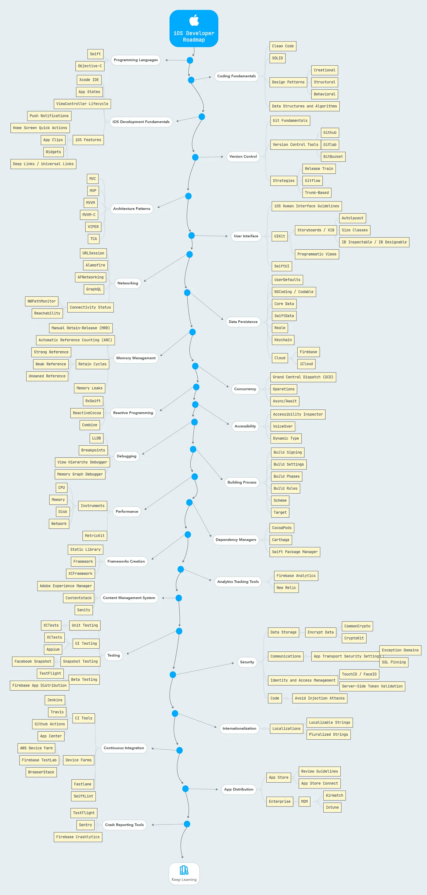

# SwiftUI Tutorials and Notes

This repository contains a collection of tutorials and notes from Mohammad Azam's Udemy course on SwiftUI. The content has been learned and documented for future reference.

## Topics Covered

